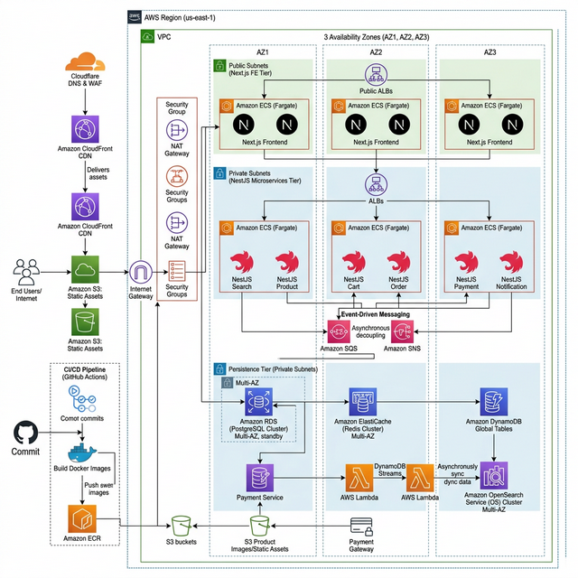
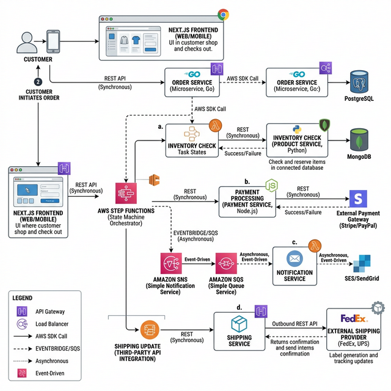

# AWS eCommerce Platform - Cloud Native & Microservices



## 🏗 Project Architecture

This platform is a high-availability, scalable e-commerce solution built natively on AWS. It leverages a microservices-oriented approach to ensure decoupling and independent scalability of core business domains.

### 🌐 Networking & Security
*   **VPC Design**: A custom-built **Multi-AZ VPC** with three distinct tiers of subnets:
    *   **Public Subnets**: Host the Application Load Balancer (ALB) and NAT Gateways.
    *   **Private (App) Subnets**: Host the ECS Fargate tasks. These are isolated from direct internet access.
    *   **Data Subnets**: Host RDS, ElastiCache, and OpenSearch for maximum data isolation.
*   **Edge Security**: **Cloudflare** handles DNS, providing a WAF and DDoS protection before traffic reaches the AWS **Application Load Balancer**.
*   **Authentication**: **AWS Cognito** provides a fully managed user directory and OAuth 2.0 compliant authentication for the frontend.

### 🚀 Compute & Microservices
The system uses a **Container-First** approach with **AWS ECS Fargate** for serverless compute.
*   **Frontend**: Built with **Next.js 14** (App Router), deployed as a standalone container.
*   **Backend Services (NestJS)**:
    *   **Search Service**: Real-time product discovery via OpenSearch integration.
    *   **Product Service**: Catalog management using DynamoDB with Multi-Region/Multi-AZ replication.
    *   **Cart Service**: Sub-millisecond basket management using Redis.
    *   **Order Service**: Orchestrates the checkout workflow using **AWS Step Functions**.
    *   **Payment Service**: Mock gateway for transaction processing.
    *   **Notification Service**: Event-driven alerts via SNS/SES.

### 🔄 Business Workflows

The platform uses an event-driven model. For example, when an order is placed:
1.  **Frontend** sends a request to the **Order Service**.
2.  **Order Service** triggers a **Step Function** State Machine.
3.  State Machine coordinates: **Stock Lock (Product Service)** -> **Payment (Payment Service)** -> **Notify (Notification Service)** -> **Ship (Order Sync)**.

---

## 🐳 Local Development (Docker-First)

This project strictly follows a **Zero-Local-Environment** policy. You do not need Node.js or databases installed on your host.

### Prerequisites
*   Docker & Docker Compose.

### Running the Stack
1.  **Clone the repository**.
2.  **Start all services**:
    ```bash
    docker-compose up --build
    ```
3.  **Access the applications**:
    *   Next.js UI: [http://localhost:3000](http://localhost:3000)
    *   Microservices APIs: `localhost:3001` to `3006`.

---

## 🛠 Manual Infrastructure Deployment (Terraform)

Infrastructure is managed via modular Terraform code in the `infra/` directory, supporting **Dev** and **Prod** environments with full parity.

### 1. Development Deployment
```bash
cd infra
terraform init
terraform plan -var-file="environments/dev.tfvars"
terraform apply -var-file="environments/dev.tfvars"
```

### 2. Production Deployment
```bash
terraform plan -var-file="environments/prod.tfvars"
terraform apply -var-file="environments/prod.tfvars"
```

*Note: Production variables use higher-spec instances (e.g., `db.t3.medium`) and multi-AZ configurations.*

---

## 🚀 CI/CD & Automation (GitHub Actions)

The project includes production-grade automation for both infrastructure and applications.

### 1. Infrastructure Pipeline ([deploy-infra.yml](.github/workflows/deploy-infra.yml))
*   **Trigger**: Push to `main` branch or manual dispatch.
*   **Steps**: `Standard Lint` -> `Terraform Plan` -> `Manual Approval` (for Prod) -> `Terraform Apply`.

### 2. Application Pipeline ([deploy-services.yml](.github/workflows/deploy-services.yml))
*   **Steps**:
    *   Build optimized Docker images.
    *   Security scan images for vulnerabilities.
    *   Push to **AWS ECR**.
    *   Update **ECS Task Definitions** and trigger service deployment.

### 🔑 Required GitHub Secrets & Variables

To configure the pipelines, add the following to your GitHub Repository:

| Name | Type | Description |
| :--- | :--- | :--- |
| `AWS_ACCESS_KEY_ID` | Secret | IAM User Access Key |
| `AWS_SECRET_ACCESS_KEY` | Secret | IAM User Secret Key |
| `TF_VAR_db_password` | Secret | RDS PostgreSQL Master Password |
| `TF_VAR_db_username` | Secret | RDS PostgreSQL Master Username |
| `CLOUDFLARE_API_TOKEN` | Secret | Token for DNS/WAF management |
| `AWS_REGION` | Variable | Default region (e.g., `us-east-1`) |
| `ENVIRONMENT` | Variable | `dev` or `prod` |

---

## 📈 Monitoring & Scalability
*   **Autoscaling**: ECS services are configured with target tracking policies (CPU/Memory) to scale task counts automatically.
*   **Observability**: Integrated with **AWS CloudWatch Logs** and **Container Insights** for real-time monitoring.

---

## 📝 Document Reference
*   [Career / CV Highlights](docs/career/cv_project_highlights.md)
*   [Detailed Sprint Tasks](docs/task.md)
*   [Agile Roadmap](docs/agile_roadmap.md)
*   [Implementation Strategy](docs/implementation_plan.md)
