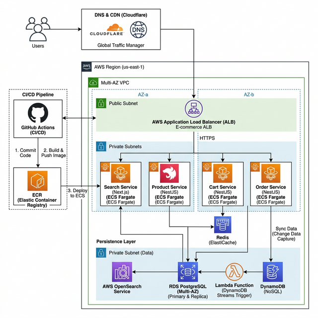

# AWS E-commerce Platform - Cloud Native & Microservices



## 🏗 Project Architecture

This platform is a high-availability, scalable e-commerce solution built natively on AWS. It leverages a microservices-oriented approach to ensure decoupling and independent scalability of core business domains.

### Core Components
- **Frontend**: A premium **Next.js 14** storefront utilizing the App Router and Tailwind CSS for a high-performance, SEO-friendly user experience.
- **Microservices**: Fully containerized **NestJS** services:
  - **Search Service**: Integrated with AWS OpenSearch for real-time product discovery.
  - **Product Service**: Manages catalog data via DynamoDB.
  - **Cart Service**: Fast, low-latency session management using Redis.
  - **Order Service**: Orchestrated by **AWS Step Functions** for robust transaction management.
- **Persistence**:
  - **RDS PostgreSQL**: Relational data for Users and structured entities.
  - **DynamoDB**: High-throughput NoSQL storage for Products and Carts.
  - **ElastiCache (Redis)**: Distributed caching and session storage.
  - **AWS OpenSearch**: Enterprise-grade search engine.
- **Infrastructure**: Managed entirely via **Terraform** with environment-specific configurations (Dev/Prod).
- **DNS & Security**: **Cloudflare** for DNS management, SSL, and Edge WAF protection.

---

## 🛠 Infrastructure Setup (IaC)

Infrastructure is managed using modular Terraform code located in the `infra/` directory.

### Prerequisites
- AWS CLI configured with appropriate permissions.
- Terraform CLI (v1.5+).
- Cloudflare API Token (for DNS management).

### Deployment Steps (Dev/Prod)

1. **Initialize Terraform**:
   ```bash
   cd infra
   terraform init
   ```

2. **Deploy to Development**:
   ```bash
   terraform apply -var-file="environments/dev.tfvars"
   ```

3. **Deploy to Production**:
   ```bash
   terraform apply -var-file="environments/prod.tfvars"
   ```

---

## 🐳 Local Development (Docker-First)

> [!IMPORTANT]
> **Zero Local Installation**: This project enforces a strict containerized development flow. Do NOT run `npm install` or `node` directly on your host machine.

### Running the Entire Stack
To start all microservices and the frontend locally using Docker Compose:

```bash
docker-compose up --build
```

### Accessing Services
- **Frontend**: [http://localhost:3000](http://localhost:3000)
- **Search API**: [http://localhost:3001](http://localhost:3001)
- **Product API**: [http://localhost:3002](http://localhost:3002)
- **Cart API**: [http://localhost:3003](http://localhost:3003)
- **Order API**: [http://localhost:3004](http://localhost:3004)

---

## 🚀 CI/CD & Deployment

Automation is handled via **GitHub Actions**:
1. **Infra Pipeline**: Deploys Terraform changes on merge to `main` (requires manual approval for Prod).
2. **Service Pipeline**: Builds Docker images, scans for vulnerabilities, pushes to **AWS ECR**, and triggers blue/green deployments on **ECS Fargate**.

---

## 📝 Documentation & Agile
Detailed project plans, meeting notes, and sprint progress are maintained in the `docs/` folder:
- [Agile Roadmap](docs/agile_roadmap.md)
- [Sprint Tasks](docs/task.md)
- [Implementation Plan](docs/implementation_plan.md)
- [Meeting Notes](docs/meetings/)
